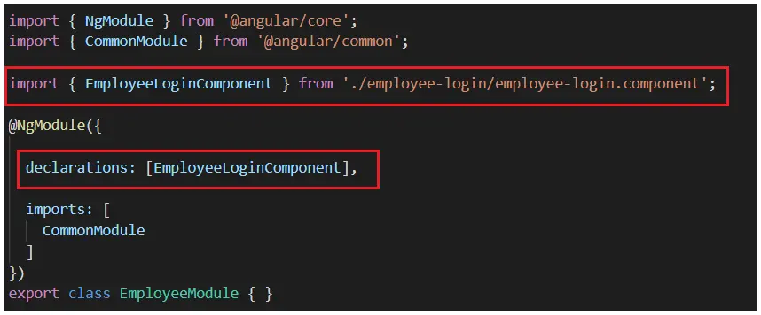
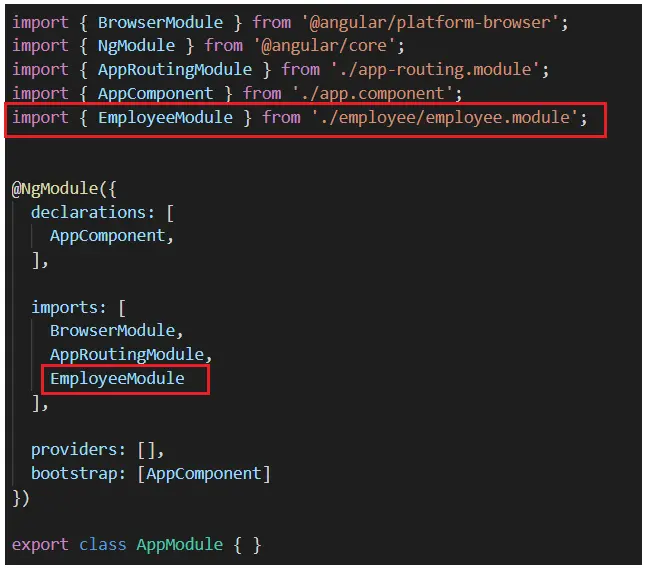
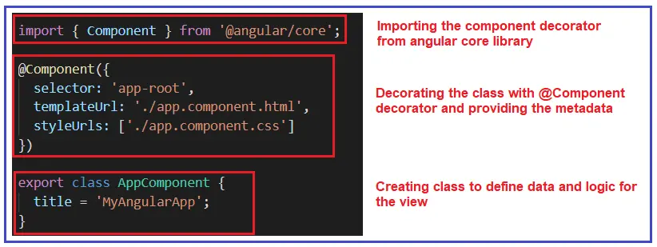
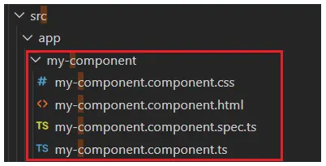
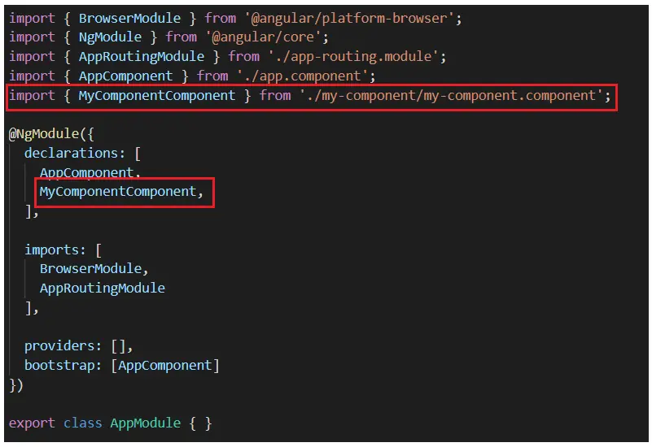
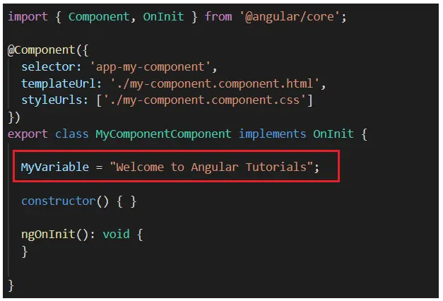
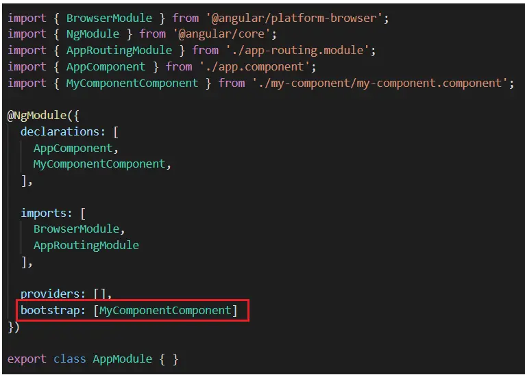
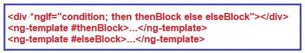

See https://dotnettutorials.net/lesson/angular-container-nested-components/

### create the angular project 

```sh
ng new MyAngularApp
```

if you get some error:

```sh
npm cache clean –force
npm install -g @angular/cli@latest
```

### Change the directory to your project folder:

```sh
cd MyAngularApp
```

### Compiling Angular Project

```sh
ng serve
```

or 

```sh
ng serve -o
```

### How to create a Module in Angular? (Create employee module)

```sh
cd MyAngularApp
ng g module employee
```

### Creating employeeLogin Component within employee module folder

```sh
ng g c employee/employeeLogin
```


### Adding employeeLogin component reference in employee module



### Adding employee module reference in AppModule import section



### 





### 

```sh
ng g c MyComponent
```





#### Modifying my-component.component.ts file:



#### Modifying my-component.component.html file:

```html
<h1>This is coming from mycomponent</h1>
<hr>
{{MyVariable}}
```

#### Modify the index.html file as shown below:

```html
<!doctype html>
<html lang="en">
<head>
  <meta charset="utf-8">
  <title>MyAngularApp</title>
  <base href="/">
  <meta name="viewport" content="width=device-width, initial-scale=1">
  <link rel="icon" type="image/x-icon" href="favicon.ico">
</head>
<body>

  <app-my-component></app-my-component>

</body>
</html>
```

#### Setting MyComponentComponent is the start point:



### Types of Directives in Angular:

#### ngFor

*ngFor=”let <value> of <collection>”

- Structural Directives
  - NgFor (*ngFor)
    - *ngFor="let <value> of <collection>"
    - ngFor – Local Variables:
      - Index: This variable is used to provide the index position of the current element while iteration.
      - First: It returns boolean true if the current element is the first element in the iteration else it will return false.
      - Last: It returns boolean true if the current element is the last element in the iteration else it will return false.
      - Even: It returns boolean true if the current element is even element based on the index position in the iteration else it will return false.
      - Odd: It returns boolean true if the current element is an odd element based on the index position in the iteration else it will return false.
  - NgIf (*ngIf)
    - *ngIf = “expression”
    - *ngIf = “condition; else elseBlock”
      - <ng-template #elseblock>….</ng-tempalte>

  
    - 
  - NgSwitch (*ngSwitch) 
- Attribute Directive
  - NgStyle
  - NgClass
- Component Directives

#### ngIf

*ngIf = “expression”